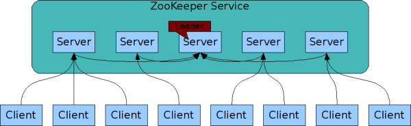
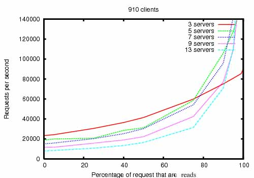
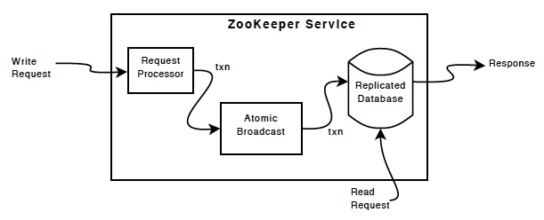

alias:: ZooKeeper
sources:: https://zookeeper.apache.org/doc/current/zookeeperOver.html

- Short description
  heading:: true
	- open-source server which enables highly reliable distributed coordination.
- Long description
  heading:: true
	- Centralized service for maintaining configuration information, naming, providing distributed synchronization, and providing group services.
	- ZooKeeper works using distributed processes to **coordinate** with each other through a shared hierarchical name space that is modeled after a file system.
	- is more a state based system than an event system (because of [this](((625b55f8-43ae-42f5-a8c1-d1c1310010a0))))
- Especially useful for
  heading:: true
	- distributed applications
- Characteristics
  heading:: true
	- Data storage
	  collapsed:: true
		- data is kept in memory and is backed up to a log for reliability.
			- By using memory, it is very fast and can handle the high loads typically seen in chatty coordination protocols across huge numbers of processes
			- using a memory based system also mean you are limited to the amount of data that can fit in memory
				- so it's not useful as a general data store. It's meant to store small bits of configuration information rather than large blobs.
	- Data model
	  collapsed:: true
		- hierarchical namespace
		- 
		- Nodes (znode) and ephemeral nodes
			- nodes can have data and children
			- maintain a stat structure
				- version numbers for data changes
				- ACL changes
				- timestamps
					- to allow cache validations and coordinated updates
			- Each time a znode's data changes, the version number increases.
			- Whenever a client retrieves data it also receives the version of the data.
			- Read and written atomically
			- Reads get all the data bytes associated with a znode
			- Write replaces all the data.
			- Each node has an Access Control List (ACL)
			- Ephemeral nodes
				- exists as long as the session that created the znode is active.
		-
	- [[replication]]
	  collapsed:: true
		- replication is used for scalability and reliability which means it prefers applications that are heavily read based.
			- 
			- must all know about each other
			- They maintain in-memory
				- image of state
			- They maintain in a persistent store
				- transaction logs
				- snapshots
	- [[Availability]]
	  collapsed:: true
		- majority of the servers
	- Client
	  collapsed:: true
		- Clients connect to a single ZooKeeper server.
		- The client maintains a TCP connection through which it
			- sends requests
			- gets responses,
			- ets watch events
			- sends heart beats
		- If the TCP connection to the server breaks, the client will connect to a different server.
	- ordered
	  collapsed:: true
		- ZooKeeper stamps each update with a number that reflects the order of all ZooKeeper transactions.
			- Subsequent operations can use the order to implement higher-level abstractions, such as synchronization primitives.
	- fast speed (especially reads)
	  collapsed:: true
		- It is especially fast in "read-dominant" workloads.
			- ZooKeeper applications run on thousands of machines, and it performs best where reads are more common than writes, at ratios of around 10:1.
		- 
	- typical of hierarchical systems you can
	  collapsed:: true
		- add nodes at any point of a tree
		- get a list of entries in a tree
		- get the value associated with an entry
		- get notification of when an entry changes or goes away
	- [[reliability]]
	  collapsed:: true
		- the leader election algorithm allows for the system to recover fast enough to prevent throughput from dropping substantially.
			- #+BEGIN_QUOTE
			  In our observations, ZooKeeper takes less than 200ms to elect a new leader.
			  #+END_QUOTE
		- As followers recover, ZooKeeper is able to raise throughput again once they start processing requests.
- Weakness
  heading:: true
  collapsed:: true
	- id:: 625b55f8-43ae-42f5-a8c1-d1c1310010a0
	  #+BEGIN_IMPORTANT
	  You cannot reliably see every change that happens to a node
	  #+END_IMPORTANT
		- because watches are one time triggers and there is latency between getting the event and sending a new request to get a watch
		- Be prepared to handle the case where the znode changes multiple times between getting the event and setting the watch again. (You may not care, but at least realize it may happen.)
- Concepts
  heading:: true
  collapsed:: true
	- _watches_
		- Clients can set a watch on a znode.
		- A watch will be triggered and removed when the znode changes.
		- When a watch is triggered, the client receives a packet saying that the znode has changed.
		- New in 3.6.0: Clients can also set permanent, recursive watchesnot removed when triggered on a znode and that also trigger for changes on children recursively.
	- _watch event_
		- a one-time trigger, sent to the client that set the watch, which occurs when the data for which the watch was set changes.
- Guarantees
  heading:: true
  collapsed:: true
	- [[Sequential Consistency]] - ((626eb181-293d-47a5-9f64-410cf04495e4))
	- [[atomicity]] - ((626eb1af-a8f7-4109-8f10-fd6a528edecb))
	- [[Single System Image]] - ((626eb1e6-62c6-440d-ac66-54b47184ffaf))
		- local replicas never diverge
	- [[reliability]] - ((626eb1cc-f7f7-4cb6-9fa0-7bb4823086ff))
	- [[timeliness]] - ((626eb254-7195-4901-9ab3-9c5d66625dc2))
- API
  heading:: true
  collapsed:: true
	- create : creates a node at a location in the tree
	- delete : deletes a node
	- exists : tests if a node exists at a location
	- get data : reads the data from a node
	- set data : writes data to a node
	- get children : retrieves a list of children of a node
	- sync : waits for data to be propagated
- Implementation
  heading:: true
  collapsed:: true
	- Components
		- 
	- Replicated database is an in-memory database containing the entire data tree
	- Updates are logged to disk for recoverability, and writes are serialized to disk before they are applied to the in-memory database.
	- Clients connect to exactly one server to submit requests.
	- Read requests are serviced from the local replica of each server database.
	- Requests that change the state of the service, write requests, are processed by an agreement protocol.
		- all write requests from clients are forwarded to a single server, called the leader.
	- Followers receive message proposals from the leader and agree upon message delivery.
	- The messaging layer takes care of replacing leaders on failures and syncing followers with leaders.
	- messaging layer is atomic