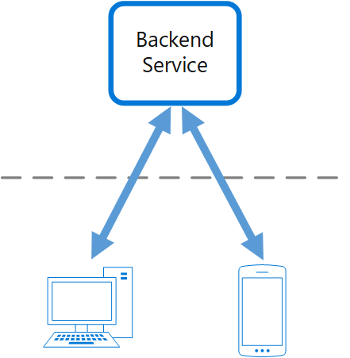
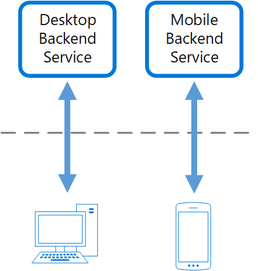

sources:: https://docs.microsoft.com/en-us/azure/architecture/patterns/backends-for-frontends
tags:: cloud design pattern

- Short description
	- separate backend services consumed by specific frontend applications or interfaces.
	  id:: 62829e3e-0de8-48c4-94f8-ac9bea348f6e
- Purpose
	- avoid customizing a single backend for multiple interfaces.
- Advantages
	- The backend can be optimized for the specific interface it serves.
	  id:: 62829f01-8ee3-4479-8033-4a9633956236
	- It can be smaller, less complex, and likely faster than a generic backend
	- Each interface team has autonomy to control their own backend and doesn't rely on a centralized backend development team.
- Considerations / Issues / Disadvantages
	- Consider the real necessity to implement a backend for each interface (most times a single backend suffice)
		- If different interfaces (such as mobile clients) will make the same requests, a single backend may suffice.
	- #+BEGIN_IMPORTANT
	  Frontend-focused backend services should only contain client-specific logic and behavior. General business logic and other global features should be managed elsewhere in your application.
	  #+END_IMPORTANT
	- Likely code duplication across services
	- Consider how long it will take to implement this pattern.
		- Will the effort of building the new backends incur technical debt, while you continue to support the existing generic backend?
- When to use?
	- A shared or general purpose backend service must be maintained with significant development overhead.
	- You want to optimize the backend for the requirements of specific client interfaces.
	- Customizations are made to a general-purpose backend to accommodate multiple interfaces.
	- An alternative language is better suited for the backend of a different user interface.
- Example
	- 
	  becomes
	  