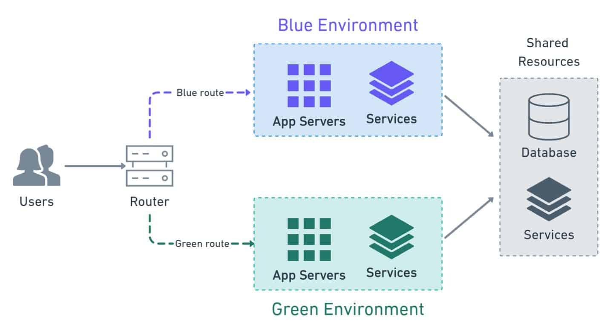

sources:: https://semaphoreci.com/blog/blue-green-deployment
tags:: deployment strategy

- Short description
	- a release management technique that reduces risk and minimizes downtime.
- uses two production environments to provide reliable testing, continuous no-outage upgrades, and instant rollbacks.
-
- side-by-side deployment
	- two separate but identical environments
-
- Benefits
  collapsed:: true
	- reliable testing
	  background-color:: #497d46
	- continuous no-outage upgrades
	  background-color:: #497d46
	- instant rollbacks.
	  background-color:: #497d46
-
- Downsides
  collapsed:: true
	- Cold starts
	  background-color:: #793e3e
		- users may experience slowness when they are suddenly switched to the new environment.
		- Any undetected performance problems are likely to appear at this point.
		- Warm-up jobs and stress tests mitigate these issues.
	- Costs
	  background-color:: #793e3e
		- Provisioning infrastructure on-demand helps.
		- when we’re making several scaled-out deployments per day, the costs can snowball.
	- Time
	  background-color:: #793e3e
		- setting up the process takes time and effort.
		- The process is complex and has a great deal of responsibility.
		- may need to do many iterations before get it right.
	- Databases
	  background-color:: #793e3e
		- database migrations are harder, even to the point of being a showstopper.
		- Databases schema changes must be forward and backward compatible.
		- The problem is compounded when we have two databases, one for blue and one for green.
		- Keeping data in sync is hard.
		- Common strategies to deal with this involve using replication or making one database read-only.
	- User transactions
	  background-color:: #793e3e
		- during the cut-over, some user transactions will be interrupted.
		- We must carefully consider how to handle them. H
		- ow should we deal with half-applied transactions?
			- Do we present an error message and tell the user to try again?
			- Do we try to carry them over to the new environment?
			- One possible solution is to feed all the transactions to both environments simultaneously, in parallel.
				- In this scenario, we would need to deal with any duplicated data after the deployment finishes.
	- Shared services
	  background-color:: #793e3e
		- databases and other shared services can leak information between blue and green.
		- Be careful not to allow one environment may affect the other indirectly.
			- This could break the isolation rule and interfere with the deployment.
-
- Image
  collapsed:: true
	- 