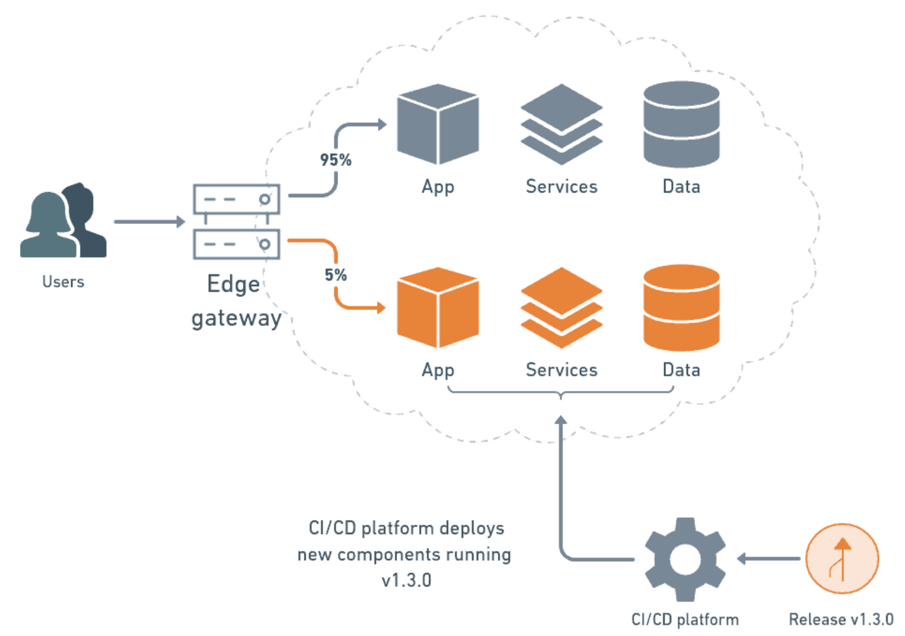

sources:: https://semaphoreci.com/blog/what-is-canary-deployment
tags:: deployment strategy

- Short description
	- The practice of making staged releases. Roll out a software update to a small part of the users first, so they may test it and provide feedback. Once the change is accepted, the update is rolled out to the rest of the users.
-
- Benefits
	- A/B  testing
		- by presenting two alternatives to the users and see which gets better reception.
	- Capacity test
		- Any performance issues we have in our system will begin to crop up as we slowly migrate the users to the canary.
	- Feedback from real users
		- Shows how users interact with application changes in the real world
	- No cold-starts
		- New systems can take a while to start up.
		- Canary deployments slowly build up momentum to prevent cold-start slowness.
	- No downtime
	- Easy rollback
- Downsides
	- Frustration
		- the first group using the canary will find the worst bugs.
	- Costs
		- side-by-side deployments cost is higher because we need extra infrastructure.
	- Complexity
		- canary deployments share the same complexities as blue-green deployments.
		- Having many production machines, migrating users, and monitoring the new system; these are complicated tasks.
		- Avoid at all costs doing them by hand.
		- Always automate the deployment process using a CI/CD platform.
	- Time
		- setting up a healthy canary deployment pipeline takes time and effort.
		- On the plus side, once we get it right we can do more frequent and safer deployments.
	- Databases
		- We need to maintain backward compatibility.
		- The problem is the database must simultaneously work with the canary and the control versions during the deployment.
		- Entire books have been written on how to make database schema changes.
-
- Splitting stable and development branches is a common practice.
- Compare to [[Blue-Green deployment]] canary deployments are smoother, and failures have limited impact.[*](https://semaphoreci.com/blog/what-is-canary-deployment)
-
- _canary release_
	- an early build of an application
- _canary deployment_
	- install the update in systems and split the users into two groups.
	- A small percentage of them will go to the canary while the rest stay on the old version, as a control.
	-
- After evaluating the canary version
	- decide to migrate the rest of the users or rollback
	-
- rolling deployments
	- install the changes in waves or stages, a few machines at a time
- side-by-side deployments
	- create a whole new duplicate environment and install the canary version there.
	- 
-
- Strategies for Migrating Users
	- Randomly
	- By region: deploy the canary one geographical area at a time.
		- For example, we could choose a follow-the-night strategy and release during each region’s nighttime, when there are the least users online.
	- Early adopter program
		- giving users a chance to opt-in (or opt-out) the canary program might lead to the best results.
		- Early adopters are more likely to offer quality feedback.
	- Dogfooding
		- releasing the canary to internal users and employees first.