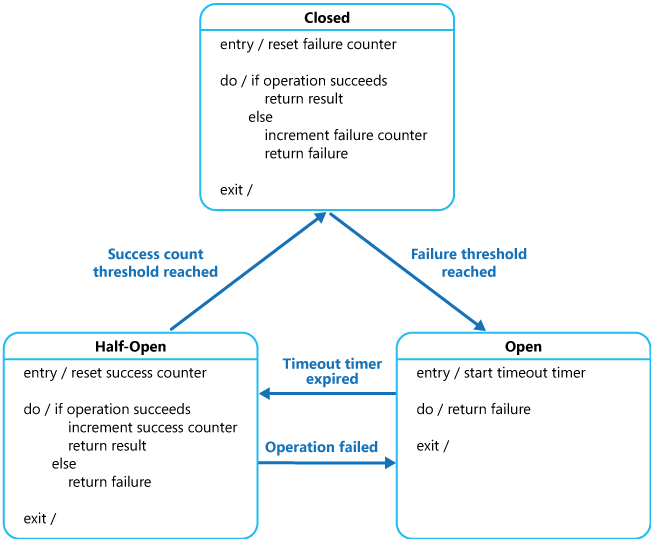

sources:: [Microsoft docs](https://docs.microsoft.com/en-us/azure/architecture/patterns/circuit-breaker), [Wikipedia](https://en.wikipedia.org/wiki/Circuit_breaker_design_pattern)
tags:: cloud design pattern, design pattern

- Short description
	- Detect and handle faults that might take a variable amount of time to recover from, when connecting to a remote service or resource.
- Purpose
  heading:: true
	- improve the stability and resiliency
		- preventing a failure from constantly recurring, during maintenance, temporary external system failure or unexpected system difficulties
	- handle the error quickly and gracefully without waiting for TCP connection timeout.
- need to
  heading:: true
	- retain the state of the connection over a series of requests.
		- in other words, record the state of the external service on a given interval.
	- offload the logic to detect failures from the actual requests.
	- operate in some sense concurrently with the requests passing through it
	- When it is using a storage layer that is external to the app
		- before the external service is used from the application, the storage layer is queried to retrieve the current state.
- Disadvantages
  heading:: true
	- negatively affect performance
		- adds code into the execution path to check for the state of the circuit.
	- resource consumption
		- running the circuit breaker code itself consumes resources on the system where it is running
- Not recommended
  heading:: true
	- For handling access to local private resources in an application, such as in-memory data structure.
		- Because of the added overhead
	- As a substitute for handling exceptions in the business logic of your applications.
- Considerations
  heading:: true
	- The storage layer used, type of [[cache]], for example, disk-based vs. memory-based and local vs. network.
	- An application invoking an operation through a circuit breaker must be prepared to handle the exceptions raised if the operation is unavailable.
		- temporarily degrade its functionality
		  id:: 6282a9a8-8ffd-4c53-9632-e399a1821e8a
		- invoke an alternative operation to try to perform the same task or obtain the same data
		- report the exception to the user and ask them to try again later
	- examine the types of exceptions that occur and adjust its strategy depending on the nature of these exceptions.
		- For example
			- it might require a larger number of timeout exceptions to trip the circuit breaker to the Open state compared to the number of failures due to the service being completely unavailable.
	- log all failed requests (and possibly successful requests) to enable an administrator to monitor the health of the operation.
	- configure the circuit breaker to match the likely recovery pattern of the operation it's protecting
		- For example
			- if the circuit breaker remains in the Open state for a long period, it could raise exceptions even if the reason for the failure has been resolved.
	- Testing Failed Operations
		- In the Open state, rather than using a timer to determine when to switch to the Half-Open state, a circuit breaker can instead periodically ping the remote service or resource to determine whether it's become available again.
			- This ping could take the form of an attempt to invoke an operation that had previously failed, or it could use a special operation provided by the remote service specifically for testing the health of the service
	- provide a manual reset (manual override) option that enables an administrator to close a circuit breaker (and reset the failure counter).
		- Similarly, an administrator could force a circuit breaker into the Open state (and restart the timeout timer) if the operation protected by the circuit breaker is temporarily unavailable.
	- The implementation shouldn't block concurrent requests or add excessive overhead to each call to an operation.
	- Be careful when using a single circuit breaker for one type of resource if there might be multiple underlying independent providers.
		- For example
			- in a data store that contains multiple shards, one shard might be fully accessible while another is experiencing a temporary issue.
			- If the error responses in these scenarios are merged, an application might try to access some shards even when failure is highly likely, while access to other shards might be blocked even though it's likely to succeed.
	- Sometimes a failure response can contain enough information for the circuit breaker to trip immediately and stay tripped for a minimum amount of time.
		- For example
			- the error response from a shared resource that's overloaded could indicate that an immediate retry isn't recommended and that the application should instead try again in a few minutes.
		- #+BEGIN_TIP
		  A service can return HTTP 429 (Too Many Requests) if it is throttling the client
		  #+END_TIP
	- Replaying Failed Requests
		- In the Open state, rather than simply failing quickly, a circuit breaker could also record the details of each request to a journal and arrange for these requests to be replayed when the remote resource or service becomes available.
	-
- States
  heading:: true
	- 
	- Closed
		- Normal
		- If the number of failures increases beyond the threshold, goes into an open state.
	- Open
		- Returns an error immediately without even invoking the services
		- Move into the half-open state after a timeout period elapses
	- Half Open
		- Allows a limited number of requests to passthrough and invoke the operation.
		- If the requests are successful
			- go to the Closed state.
		- else
			- it goes back to Open state.
- Tools
  heading:: true
	- [[Netflix Hystrix]]
	- [[Istio]]