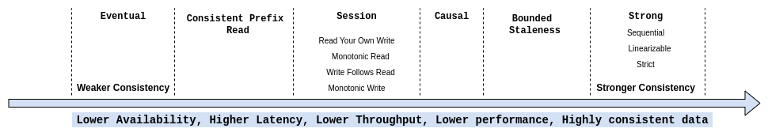
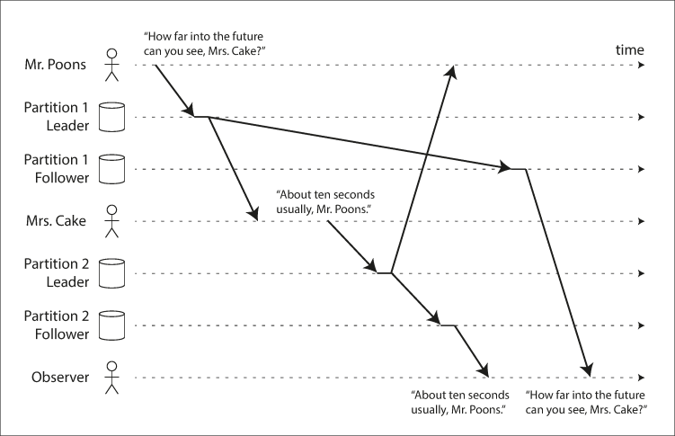

sources:: https://ebrary.net/64710/computer_science/consistent_prefix_reads

- 
- replication lag anomalies
	- violation of causality
	  collapsed:: true
		- 
- guarantees
	- [[consistent prefix reads]] - ((62571d0e-bbb7-4c34-9275-24acc8c004ca))
- transactions properties
	- ACID
		- Atomicity
		- Consistency
		- Isolation
		- Durability