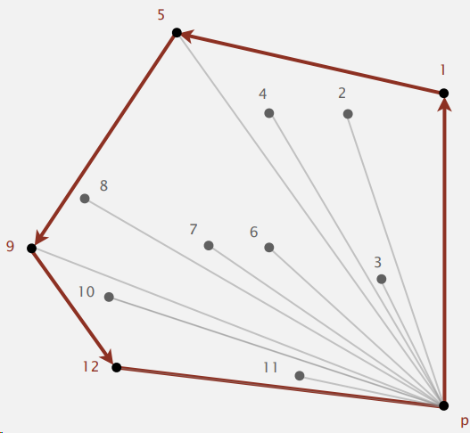

sources:: [Coursera course](https://www.coursera.org/learn/algorithms-part1/lecture/KHJ1t/convex-hull)

- Short description
	- The convex hull of a set of N points is the smallest perimeter fence enclosing the points.
- 
- The convex hull algorithm's output is a sequence of vertices in counterclockwise order
- The vertices of convex hull appear in increasing order of polar angle with respect to point p with lowest y-coordinate.
	- 
- Graham scan
	- Choose point `p` with smallest y-coordinate.
	- Sort points by polar angle with `p`.
	- Consider points in order; discard unless it create a counter-clockwise turn
	- 
	- for each vertex calculate the polar angle to respect with `p`(it's like a counter-clockwise sweep of a radar)
	- sort the vertices by that value
	- you need to be able to
		- determine whether `p1 -> p2 -> p3` is a counter-clockwise turn
			- computational geometry
				- Determinant (or cross product) gives 2x signed area of planar triangle
				- 
				- If signed area > 0, then a→ b→ c is counterclockwise.
				  If signed area < 0, then a→ b→ c is clockwise.
				  If signed area = 0, then a→ b→ c are collinear.
				- 
				- ```java
				  public static int ccw(Point2D a, Point2D b, Point2D c) {
				  	double area2 = (b.x-a.x)*(c.y-a.y) - (b.y-a.y)*(c.x-a.x); // danger of floating-point roundoff error
				  	if (area2 < 0) return -1; // clockwise
				  	else if (area2 > 0) return +1; // counter-clockwise
				  	else return 0; // collinear
				  }
				  ```
		- take care of degeneracies (three or more points on a line)
	- ```java
	  Stack<Point2D> hull = new Stack<Point2D>();
	  
	  Arrays.sort(p, Point2D.Y_ORDER); // p[0] is now point with lowest y-coord
	  Arrays.sort(p, p[0].BY_POLAR_ORDER); // sort by polar angle with respect to p[0]
	  
	  // the following 2 points are definitely on hull
	  hull.push(p[0]);
	  hull.push(p[1]);
	  
	  for (int i = 2; i < N; i++) {
	    Point2D top = hull.pop();
	    // discard points that would create clockwise turn
	    while (Point2D.ccw(hull.peek(), top, p[i]) <= 0)
	      top = hull.pop();
	    hull.push(top);
	    hull.push(p[i]); // <- add p[i] to putative hull
	  }
	  ```
	- running time N log N for sorting and linear for rest
	- each point pushed and popped at most once