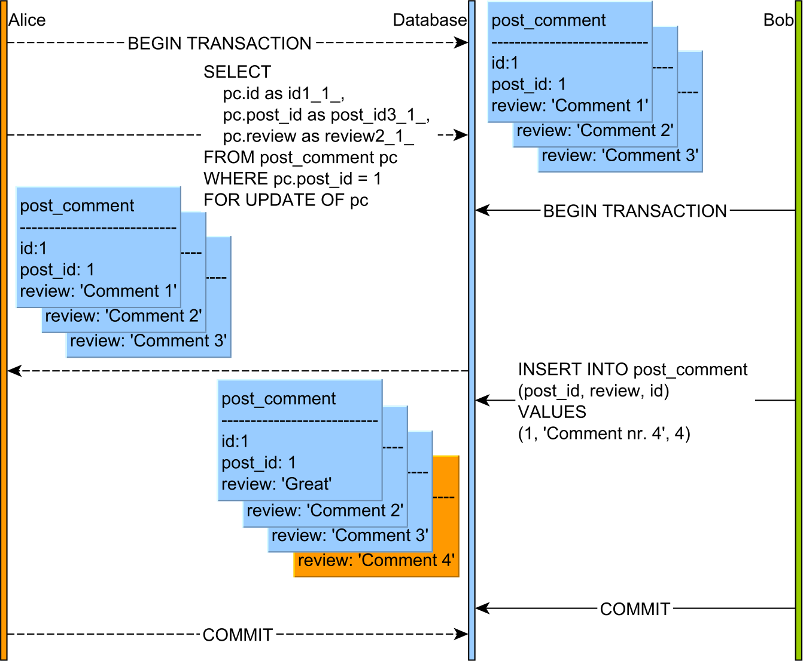

sources:: https://www.geeksforgeeks.org/levels-of-locking-in-dbms/

- [[Levels of locking in DBMS]]
- Lock modes #WIP
	- Exclusive (X) Lock
	- Shared (S) Lock
	- Intent exclusive (IX) Lock
	- Intent shared (IS) Lock
	- Shared intent exclusive (SIX) Lock
	- Update (U) Lock
- https://tutorialink.com/dbms/types-of-locks.dbms #WIP
- [[Types of Keys in Relational Model]]
- Live Lock
	- Livelock situation can be defined as when two or more processes continually repeat the same interaction in response to changes in the other processes without doing any useful work These processes are not in the waiting state, and they are running concurrently. This is different from a deadlock because in a deadlock all processes are in the waiting state.
- on most RDBMS, explicit physical locks (SELECT ... FOR UPDATE) can only prevent record modifications for database records that existed at the time of locking while **future records can be added**.
  sources:: https://vladmihalcea.com/how-does-database-pessimistic-locking-interact-with-insert-update-and-delete-sql-statements/
	- image example:
		- 
		  Bob’s INSERT statement is executed right away even if Alice’s transaction tried to lock all PostComment entries.
		-