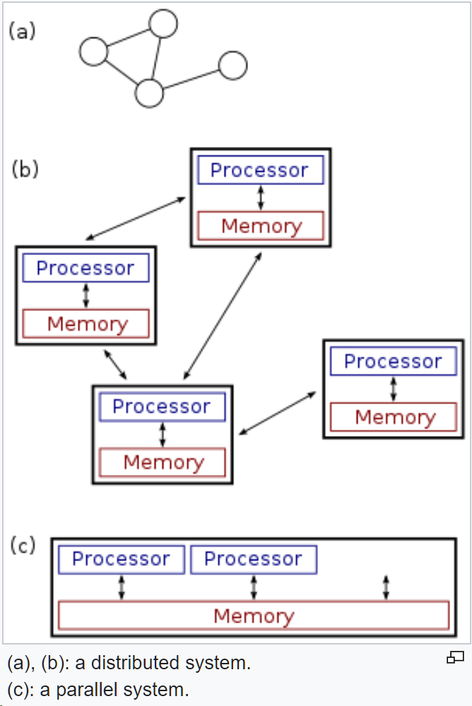

- 
- Characteristics
	- components located on different networked computers or also autonomous processes that run on the same physical computer.
	- each component / process has its own local memory
	- concurrency of components
	- lack of a global clock
	- independent failure of components
	- the structure of the system (network topology, network latency, number of computers) is not known in advance, the system may consist of different kinds of computers and network links, and the system may change during the execution of a distributed program.
	- each computer has only a limited, incomplete view of the system.
- communication mechanisms
	- HTTP
	- RPC-like connectors
	- message queues
	- etc...
-