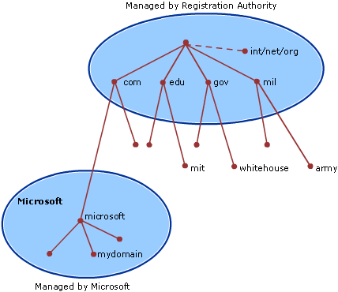

alias:: DNS
sources:: https://github.com/donnemartin/system-design-primer#domain-name-system, [Wikipedia](https://en.wikipedia.org/wiki/Domain_Name_System), [Microsoft documentation](https://docs.microsoft.com/en-us/previous-versions/windows/it-pro/windows-server-2008-R2-and-2008/dd197427(v=ws.10)?redirectedfrom=MSDN)

- Short description
	- Translates a domain name such as www.example.com to an IP address.
- Characteristics
	- Hierarchical, with a few authoritative servers at the top level.
		- 
	- maintained by a distributed database system
	- uses the client–server model.
- The router or ISP provides information about which DNS server(s) to contact when doing a lookup.
- Caching
	- Lower level DNS servers cache mappings
	  background-color:: #978626
		- which could become stale due to DNS propagation delays.
	- By browser or OS
	  background-color:: #978626
		- for a certain period of time --> time to live (TTL).
- Integration
	- 
- Resolving
	- 
- Payload
	- NS record (name server)
		- Specifies the DNS servers for your domain/subdomain.
	- MX record (mail exchange)
		- Specifies the mail servers for accepting messages.
	- A record (address)
		- Points a name to an IP address.
	- CNAME (canonical)
		- Points a name to another name or CNAME (example.com to www.example.com) or to an A record.
- Traffic routing can be provided by DNS services
	- Traffic routing methods
		- Weighted round robin
		  background-color:: #978626
			- Prevent traffic from going to servers under maintenance
			- Balance between varying cluster sizes
			- A/B testing
		- Latency-based
		  background-color:: #978626
		- Geolocation-based
		  background-color:: #978626
- Managed DNS services
	- CloudFlare, [[AWS Route 53]]
- Disadvantages
	- Slight delay
		- Accessing a DNS server introduces a slight delay, although mitigated by caching described above.
	- Complex management
		- DNS server management could be complex and is generally managed by governments, ISPs, and large companies.
	- DDoS attack vulnerabilities
		- DNS services have recently come under DDoS attack, preventing users from accessing websites such as Twitter without knowing Twitter's IP address(es).