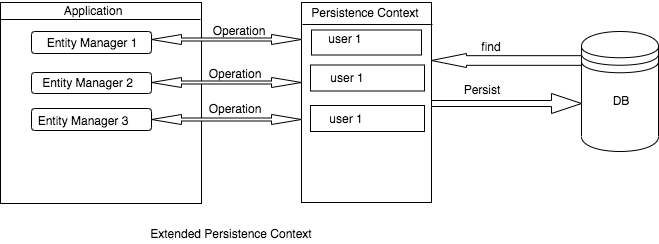

sources:: https://www.baeldung.com/jpa-hibernate-persistence-context

- 
- Can span across multiple transactions
- We can persist the entity without the transaction but cannot flush it without a transaction
- #+BEGIN_IMPORTANT
  To tell EntityManager to use extended-scoped persistence context, we need to apply the type attribute of `@PersistenceContext`:
  ```java
  @PersistenceContext(type = PersistenceContextType.EXTENDED)
  private EntityManager entityManager;
  ```
  #+END_IMPORTANT
- In the stateless session bean, the extended persistence context in one component is completely unaware of any persistence context of another component. This is true even if both are in the same transaction.
- example: 
  Let's say we persist some entity in a method of `Component A`, which is running in a transaction. We then call some method of `Component B`. In `Component B`'s method persistence context, we will not find the entity we persisted previously in the method of `Component A`.