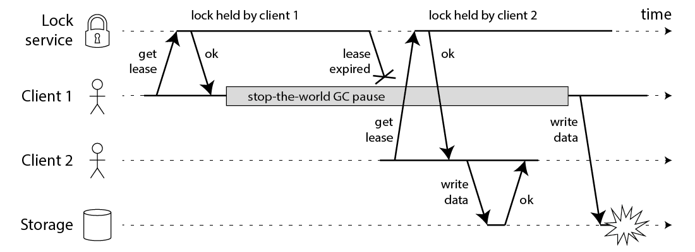
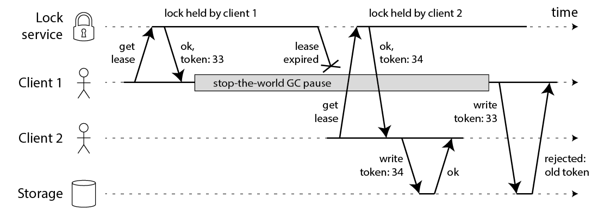

- Short Description
	- a number that increases (e.g. incremented by the lock service) every time a client acquires the lock.
	  id:: 625dadd2-8136-4b38-95e4-84b9e6f225e1
- My open question: If you are using expiration time for leases, how to deal with clock differences between nodes?
  background-color:: #793e3e
- monotonically increasing tokens
- e.g. if you are using ZooKeeper as lock service, you can use the zxid or the znode version number as fencing token
- example
  collapsed:: true
	- look at this failure
		- 
	- it is solved with fencing token
		- 