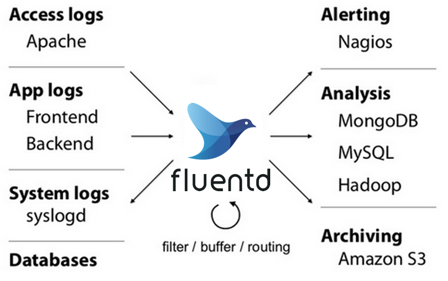

sources:: https://www.fluentd.org/
tags:: logging

- Short description
	- An open source data collector for unified logging layer. Allows you to unify data collection and consumption for a better use and understanding of data.
- decouples data sources from backend systems
- tries to structure data as JSON as much as possible
- Minimum Resources Required
	- vanilla instance runs on 30-40MB of memory and can process 13,000 events/second/core
- Built-in Reliability
	- supports
		- memory- and file-based buffering to prevent inter-node data loss.
		- robust failover and can be set up for high availability.
- 