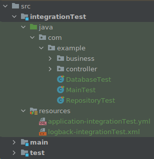

- Useful plugins:
	- https://github.com/unbroken-dome/gradle-testsets-plugin : to create extra test source sets and tasks. E.g. for integration tests.
		- make sure the testing configuration is set like:
		  ```kotlin
		  tasks.test {
		      testLogging.showExceptions = true
		      useJUnitPlatform()
		  }
		  ```
		  because by not using the name of the task, that configuration will apply to the tasks created by the plugin also.
		  
		  then in Gradle [[Kotlin]] DSL:
		  ```kotlin
		  testSets {
		      "integrationTest"()
		  }
		  ```
		  
		  with this you have a new source set
		  
-