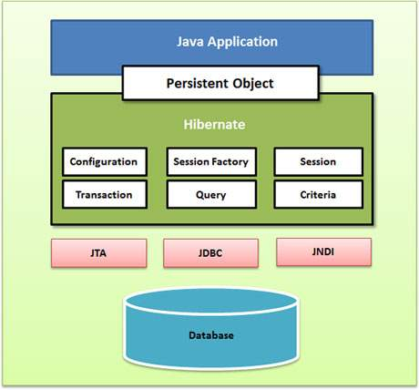

tags:: #Frameworks

- 
- `org.hibernate.SessionFactory`
	- You would need one SessionFactory object per database using a separate configuration file. So, if you are using multiple databases, then you would have to create multiple SessionFactory objects.
	  The internal state of a SessionFactory is **immutable**.
	  This internal state includes **all of the metadata about Object/Relational Mapping**.
- [[Transaction]]-related
	- important classes:
		- `org.hibernate.Session`
		  id:: 622fd6c4-e34c-47af-b549-1f55f7ba6fab
		  collapsed:: true
			- used to get a physical connection with a database
			- is lightweight and designed to be instantiated each time an interaction is needed with the database.
			- The session objects should not be kept open for a long time because they are not usually thread safe and they should be created and destroyed them as needed.
			- The lifecycle of a Session is bounded by the beginning and end of a logical transaction. (Long transactions might span several database transactions.)
			- The main function of the Session is to offer create, read and delete operations for instances of mapped entity classes. Instances may exist in one of three states:
				- **transient**: never persistent, not associated with any Session
				- **persistent**: associated with a unique Session
				- **detached**: previously persistent, not associated with any Session
			- Changes to persistent instances are detected at flush time and also result in an SQL UPDATE.
			- If the Session throws an exception, the transaction must be rolled back and the session discarded.
			- sample code:
				- ```java
				     Session sess = factory.openSession();
				     Transaction tx;
				     try {
				         tx = sess.beginTransaction();
				         //do some work
				         ...
				         tx.commit();
				     }
				     catch (Exception e) {
				         if (tx!=null) tx.rollback();
				         throw e;
				     }
				     finally {
				         sess.close();
				     }
				  ```
		- `org.hibernate.Transaction`
			- A transaction is associated with a ((622fd6c4-e34c-47af-b549-1f55f7ba6fab)) and is usually initiated by a call to `Session.beginTransaction()`. A single session might span multiple transactions since the notion of a session (a conversation between the application and the datastore) is of coarser granularity than the notion of a transaction. However, it is intended that there be at most one uncommitted transaction associated with a particular Session at any time.
		- `org.hibernate.engine.transaction.internal.TransactionImpl`
		-
-
-