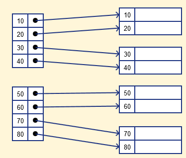
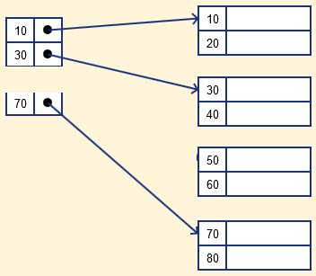
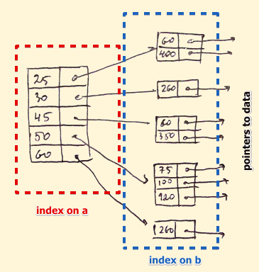

sources:: https://www.geeksforgeeks.org/indexing-in-databases-set-1, https://www.guru99.com/indexing-in-database.html
tags:: WIP

- [[Difference between Clustered and Non-clustered index]]
-
- ordered representation of indexed data
- types
	- primary
		- related to the PK
		- there is always one to one relationship between the entries in the index table
		- subtypes
			- dense
				- a record is created for every search key valued in the database
				- search faster but needs more space to store index records
				- 
			- sparse
				- a range of index columns stores the same data block address, and when data needs to be retrieved, the block address will be fetched.
				- needs less space, less maintenance overhead for insertion, and deletions but It is slower compared to the dense Index for locating records.
				- 
	- clustering
		- records themselves are stored in the Index and not pointers
		- Sometimes the Index is created on non-primary key columns which <span class="hl-neutral-01">might not be unique for each record</span>. In such a situation, you can <span class="hl-neutral-01">group two or more columns to get the unique values and create an index which is called clustered Index</span>.
	- secondary
		- extra optional indexes (normally created by you)
	- multilevel
		- when a primary index does not fit in memory
		- 
		- b-tree
			- left children < parent
			- right children >= parent
			- doubly linked list between leafs
- makes reading faster and writing slower
- execution plans / explain plan
	- EXPLAIN keyword
		- prepend this keyword before the query
	- access type / join type
		- const / eq_ref
			- traverse b-tree to find a single value (needs values to be unique (through constraints etc))
		- ref / range / index range scan
			- traverse b-tree to find starting point, scans values from that point on (remember leaf doubly linked lists)
		- index / full index scan
			- not using index to limit the search
			- will start at the first index and scan through all them until reaches the last leaf node
		- all / full table scan
			- avoid at all costs
- careful when using functions
	- example
		- ```sql
		  SELECT SUM(TOTAL)
		  FROM orders
		  WHERE YEAR(created_at) = '2012';
		  -- what the db see
		  SELECT SUM(TOTAL)
		  FROM orders
		  WHERE YEAR(...) = '2012';
		  -- so it wont use an index at created_at coolumn
		  -- for functions you can create indexes for the function itself
		  -- but in this case (dates) you should use for example BETWEEN
		  ```
		-
- probably put the data you need for the select at the index itself otherwise it will get the rowids from the index and then need to query each of those on the underlying table for the column you need that is not on the index.
	- the explain plan normally tells you when a query is using only data available at indexes to return your result.
	- tradeoff: extra data on the index, duplicated data, slows inserts/updates
- order of columns when you specify your index matters
	- if you create an index for CREATED_AT, TOTAL, USER_ID you can use this for queries that use
		- CREATED_AT
		- CREATED_AT, TOTAL
		- CREATED_AT, TOTAL, USER_ID
	- but not for
		- CREATED_AT, USER_ID
- inequality operators
	- ex: between, !=
	- it makes the usage of the index stop at the point of the inequality operation
	- example:
		- ```sql
		  -- given the index
		  -- CREATED_AT, TOTAL, USER_ID
		  -- and the query
		  SELECT SUM(total)
		  FROM orders
		  WHERE created_at BETWEEN '2013-01-01 00:00:00' AND '2013-12-31 23:59:59'
		  AND user_id = 136;
		  
		  -- the created_at is the 1st column on our index
		  -- so it is as if your index stops there, for this query, because of the inequality operator
		  
		  -- for this specific query, you should make the index as following
		  -- USER_ID, CREATED_AT, TOTAL
		  ```
- You can’t sort data in the lead nodes as the value of the primary key classifies it.
- You are not allowed to partition an index-organized table. <span class="hl-bad-01-bg">I don't know if this is specific to a db or in general</span>