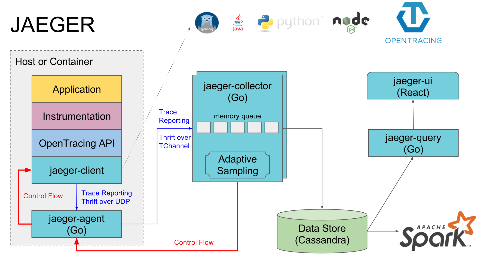
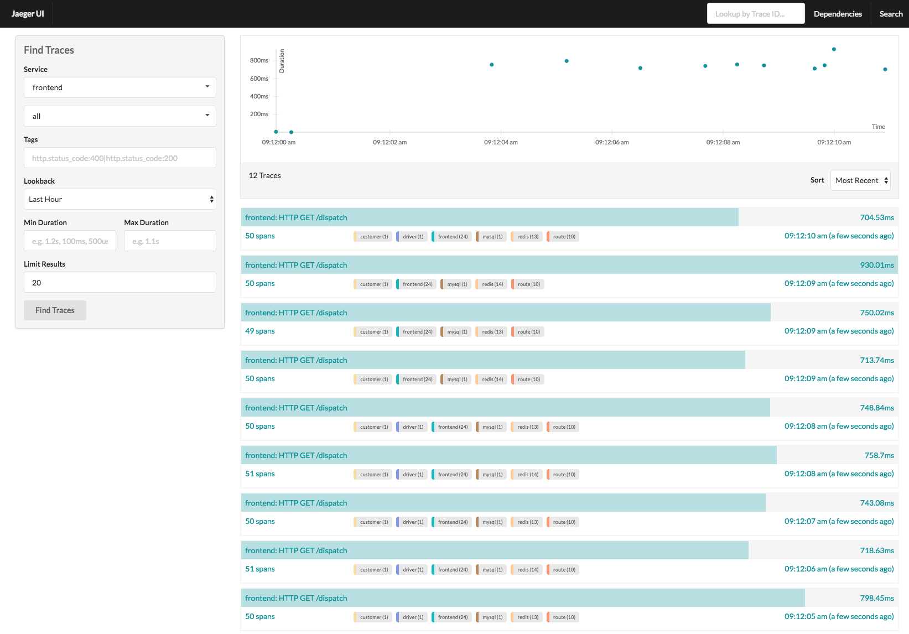
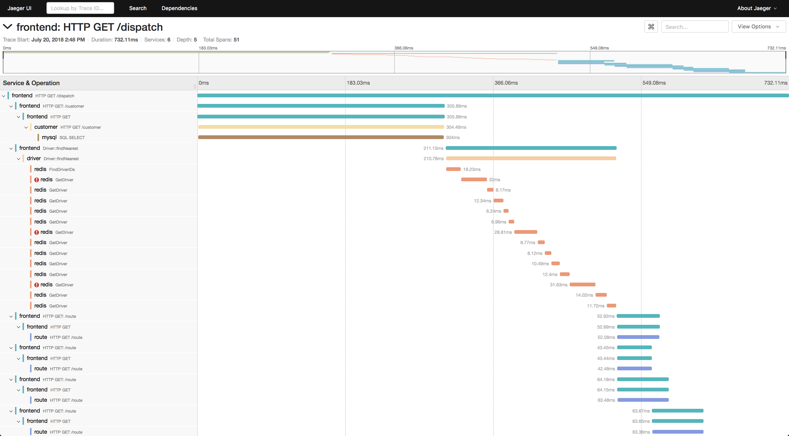

sources:: https://www.jaegertracing.io/
tags:: distributed tracing

- Short description
	- Open source, end-to-end distributed tracing. Monitor and troubleshoot transactions in complex distributed systems.
- Similar tools
	- [[Zipkin]]
- Recommended ([here](https://logz.io/blog/zipkin-vs-jaeger/)) when you are using [[Kubernetes]]
- Problems that Jaeger addresses
	- distributed transaction monitoring
	- performance and latency optimization
	- root cause analysis
	- service dependency analysis
	- distributed context propagation
- 
- 
- 