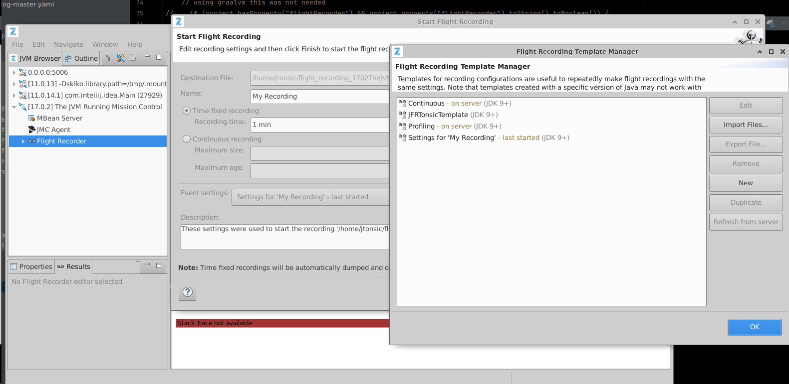

- [[Java Collections]]
- [[Java Module System]]
-
- Some useful JVM args as example
	- sources:: https://docs.oracle.com/en/java/javase/11/migrate/index.html#JSMIG-GUID-7BB28E4D-99B3-4078-BDC4-FC24180CE82B, [Azul docs Using Java Flight Recorder](https://docs.azul.com/prime/Java-Flight-Recorder)
	- --add-opens
	  collapsed:: true
		- to add reflective access to JDK classes (deep reflection to access nonpublic members, meaning `setAccessible(true)`)
		- formal syntax
			- `--add-opens module/package=target-module(,target-module)*`
			- if the <target-module> is `ALL-UNNAMED`, then the source package is exported to all unnamed modules
		- If you have to allow code on the class path to do deep reflection to access nonpublic members
		- examples:
			- `--add-opens java.base/java.lang=ALL-UNNAMED --add-opens java.base/java.util=ALL-UNNAMED --add-opens java.base/java.nio=ALL-UNNAMED --add-opens java.base/sun.nio.ch=ALL-UNNAMED--add-opens java.base/java.lang=ALL-UNNAMED --add-opens java.base/java.util=ALL-UNNAMED --add-opens java.base/java.nio=ALL-UNNAMED --add-opens java.base/sun.nio.ch=ALL-UNNAMED`
	- --add-exports
	  collapsed:: true
		- serves as an option to compile source code with references to JDK internal classes
		- If you need to use an internal API that has been made inaccessible
		- You can also use --add-exports at compile time to access internal APIs.
		- formal syntax
			- `--add-exports <source-module>/<package>=<target-module>(,<target-module>)*`
				- where <source-module> and <target-module> are module names and <package> is the name of a package.
				- if the <target-module> is `ALL-UNNAMED`, then the source package is exported to all unnamed modules
					- `--add-exports java.management/sun.management=ALL-UNNAMED`
						- allows code in all unnamed modules (code on the class path) to access the **public** members of public types in java.management/sun.management.
						  
						  #+BEGIN_WARNING
						  If the code on the class path attempts to do deep reflection to access nonpublic members, then the code fails. In this case use `--add-opens` instead.
						  #+END_WARNING
	- remote JMX configuration
	  sources:: https://docs.oracle.com/javase/8/docs/technotes/guides/management/agent.html
		- `-Dcom.sun.management.jmxremote=true -Dcom.sun.management.jmxremote.port=3614 -Dcom.sun.management.jmxremote.authenticate=false -Dcom.sun.management.jmxremote.ssl=false`
	- Flight recorder related
	  collapsed:: true
		- `-XX:+UnlockCommercialFeatures -XX:+FlightRecorder`
			- `UnlockCommercialFeatures` flag may not exist for your JVM and result in error, then just omit it.
			- if you want to immediately start recording at the beginning of an execution
				- `-XX:StartFlightRecording=filename=myrecording.jfr`
				- if you want to specify a duration for the recording
				- `-XX:StartFlightRecording=duration=60s,filename=myrecording.jfr`
		- collect a significant amount of diagnostic information
			- `-XX:FlightRecorderOptions=loglevel=debug`
			- `-XX:FlightRecorderOptions=loglevel=trace`
		- Continuous With Dump on Demand
			- `-XX:StartFlightRecording=settings=default`
		- Continuous With Dump on Exit
			- `-XX:StartFlightRecording=settings=default -XX:FlightRecorderOptions=dumponexit=true,dumponexitpath=C:\tmp`
		- With starting delay, duration of one minute, then dumping to a file, using specific settings and specifying a name
			- `-XX:StartFlightRecording=delay=20s,duration=60s,filename=C:\myRecording.jfr,settings=profile.jfc,name=SampleRecording`
		- to configure the flight recording session
			- you must first go to a java mission control, in my case I used Azul's
			- 
			- Then open any process there, open one  'start a flight recording' window, click on 'Template Manager', create a new template, click on edit, define all the options you want, apply and then export to a file. This file will be the one you put in `settings` of this `-XX:StartFlightRecording=...etc...,settings=<here your file, without the less than greater than symbols>,...etc...`
		- Specifying a max size
			- `-XX:StartFlightRecording=name=ZMC_Default,maxsize=100m`
		- other options
			- -XX:FlightRecorderOptions=stackdepth=128
		- copy paste from [this site](https://wkorando.github.io/sip-of-java/011.html)
		  collapsed:: true
			- When enabling JFR, `-XX:StartFlightRecording` can take several arguments like seen above that modify its behavior, below is the full list of arguments can take:
			  
			  *   `delay=time`: Specifies the delay between the Java application launch time and the start of the recording. Append s to specify the time in seconds, m for minutes, h for hours, or d for days (for example, specifying 10m means 10 minutes). By default, there’s no delay, and this parameter is set to 0.  
			      
			  *   `disk={true|false}`: Specifies whether to write data to disk while recording. By default, this parameter is enabled.  
			      
			  *   `dumponexit={true|false}`: Specifies if the running recording is dumped when the JVM shuts down. If enabled and a filename is not entered, the recording is written to a file in the directory where the process was started. The file name is a system-generated name that contains the process ID, recording ID, and current timestamp, similar to `hotspot-pid-47496-id-1-2018_01_25_19_10_41.jfr`. By default, this parameter is disabled.  
			      
			  *   `duration=time`: Specifies the duration of the recording. Append s to specify the time in seconds, m for minutes, h for hours, or d for days (for example, specifying 5h means 5 hours). By default, the duration isn’t limited, and this parameter is set to 0.  
			      
			  *   `filename=path`: Specifies the path and name of the file to which the recording is written when the recording is stopped, for example:  
			      
			  
			              recording.jfr
			              /home/user/recordings/recording.jfr
			              c:\recordings\recording.jfr
			      
			  
			  *   `name=identifier`: Takes both the name and the identifier of a recording.  
			      
			  *   `maxage=time`: Specifies the maximum age of disk data to keep for the recording. This parameter is valid only when the disk parameter is set to true. Append s to specify the time in seconds, m for minutes, h for hours, or d for days (for example, specifying 30s means 30 seconds). By default, the maximum age isn’t limited, and this parameter is set to 0s.  
			      
			  *   `maxsize=size`: Specifies the maximum size (in bytes) of disk data to keep for the recording. This parameter is valid only when the disk parameter is set to true. The value must not be less than the value for the maxchunksize parameter set with `-XX:FlightRecorderOptions`. Append m or M to specify the size in megabytes, or g or G to specify the size in gigabytes. By default, the maximum size of disk data isn’t limited, and this parameter is set to 0.  
			      
			  *   `path-to-gc-roots={true|false}`: Specifies whether to collect the path to garbage collection (GC) roots at the end of a recording. By default, this parameter is disabled.  
			      The path to GC roots is useful for finding memory leaks, but collecting it is time-consuming. Enable this option only when you start a recording for an application that you suspect has a memory leak. If the settings parameter is set to profile, the stack trace from where the potential leaking object was allocated is included in the information collected.  
			      
			  *   `settings=path`: Specifies the path and name of the event settings file (of type JFC). By default, the `default.jfc` file is used, which is located in `JAVA_HOME/lib/jfr`. This default settings file collects a predefined set of information with low overhead, so it has minimal impact on performance and can be used with recordings that run continuously.  
			      A second settings file is also provided, `profile.jfc`, which provides more data than the default configuration, but can have more overhead and impact performance. Use this configuration for short periods of time when more information is needed.
			  
			  Source: [https://docs.oracle.com/en/java/javase/16/docs/specs/man/java.html](https://docs.oracle.com/en/java/javase/16/docs/specs/man/java.html)
	- other options that may be useful
		- -XX:+UnlockExperimentalVMOptions
		- -XX:+IgnoreUnrecognizedVMOptions
		- -XX:+UnlockDiagnosticVMOptions
		- -XX:+DebugNonSafepoints
		- -Djava.net.preferIPv4Stack=true
		- -Djdk.attach.allowAttachSelf=true