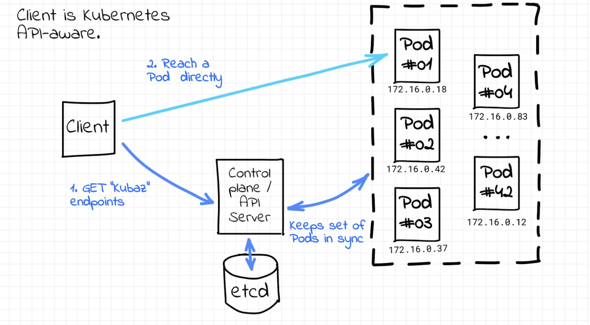
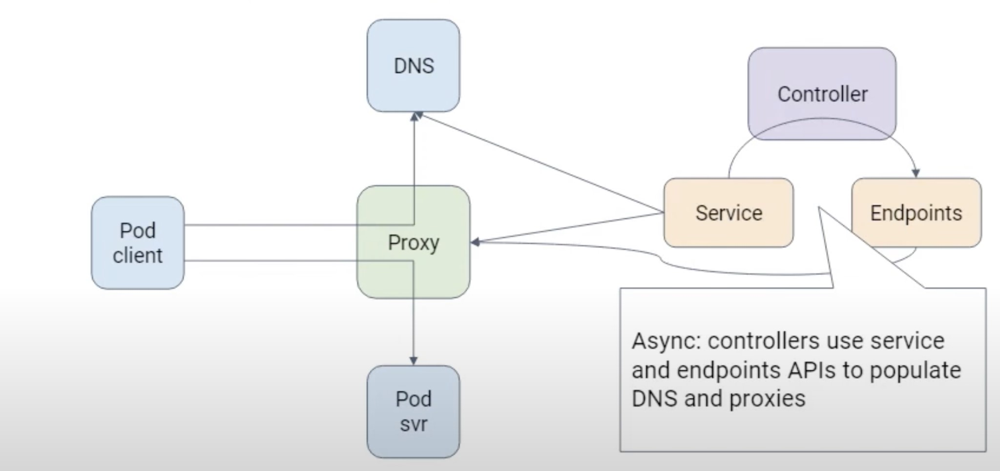

sources:: https://www.densify.com/kubernetes-autoscaling/kubernetes-service-discovery
tags:: Kubernetes, Service Discovery

- Ways
	- through its endpoints API
	  background-color:: #978626
		- then client software can discover the IP and ports of pods in an application.
		- the Kubernetes control plane ETCD can act as a service registry
			- where all the endpoints are registered and kept up to date by Kubernetes itself.
			- 
	- using service objects and kube-proxy
	  background-color:: #978626
		- Not all clients are API-aware.
		- [[Kubernetes service object]]
			- ((628bba4d-c16d-480b-a8c4-6d37c2b554f9))
		- Name to IP Mapping
			- Clients can use the DNS name of the [[Kubernetes]] service. (it is optional)
				- The internal DNS in Kubernetes handles the mapping of service names to service IP addresses.
				- 
			- Kubernetes can use environment variables for this purpose
				- When a pod is created, some variables are automatically injected into the pod to map the names to IP addresses.
				- A kube-proxy instance running on each worker node handles the underlying implementation of Kubernetes Service.