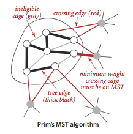
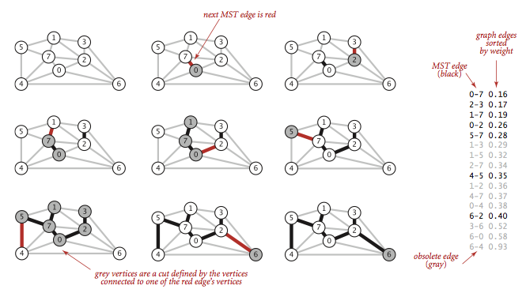

sources:: https://algs4.cs.princeton.edu/43mst/

- Short description
	- A minimum spanning tree (MST) of an ((6269965d-7abc-4a2a-a580-08fe4fbbde60)) is a spanning tree whose weight (the sum of the weights of its edges) is no larger than the weight of any other spanning tree.
- edge-weighted graph
  id:: 6269965d-7abc-4a2a-a580-08fe4fbbde60
	- is a graph where we associate weights or costs with each edge.
- Assumptions
	- The graph is connected
	  collapsed:: true
		- The spanning-tree condition in our definition implies that the graph must be connected for an MST to exist.
		- If a graph is not connected, we can adapt our algorithms to compute the MSTs of each of its connected components, collectively known as a minimum spanning forest.
	- The edge weights are not necessarily distances.
	  collapsed:: true
		- Geometric intuition is sometimes beneficial, but the edge weights can be arbitrary.
	- The edge weights may be zero or negative.
	  collapsed:: true
		- If the edge weights are all positive, it suffices to define the MST as the subgraph with minimal total weight that connects all the vertices.
- Algorithms
	- Prim's algorithm
	  collapsed:: true
		- attaching a new edge to a single growing tree at each step
		- Start with any vertex as a single-vertex tree
		- add V-1 edges to it, always taking next the minimum-weight edge that connects a vertex on the tree to a vertex not yet on the tree.
		- 
		- Lazy implementation
			- We use a priority queue to hold the crossing edges and find one of minimal weight.
			- Each time that we add an edge to the tree, we also add a vertex to the tree.
			- To maintain the set of crossing edges, we need to add to the priority queue all edges from that vertex to any non-tree vertex.
			- But we must do more: any edge connecting the vertex just added to a tree vertex that is already on the priority queue now becomes ineligible (it is no longer a crossing edge because it connects two tree vertices).
				- The lazy implementation leaves such edges on the priority queue, deferring the ineligibility test to when we remove them.
		- Eager implementation
			- Our only interest is in the minimal edge from each non-tree vertex to a tree vertex.
			- When we add a vertex v to the tree, the only possible change with respect to each non-tree vertex w is that adding v brings w closer than before to the tree.
			- In short, we do not need to keep on the priority queue all of the edges from w to tree vertices, we just need to keep track of the minimum-weight edge and check whether the addition of v to the tree necessitates that we update that minimum (because of an edge v-w that has lower weight), which we can do as we process each edge in s adjacency list.
			- In other words, we maintain on the priority queue just one edge for each non-tree vertex: the shortest edge that connects it to the tree.
	- Kruskal's algorithm
	  collapsed:: true
		- processes the edges in order of their weight values (smallest to largest), taking for the MST each edge that does not form a cycle with edges previously added, stopping after adding V-1 edges.
		- Those chosen edges form a forest of trees that evolves gradually into a single tree, the MST.
		- uses a priority queue to consider the edges in order by weight
		- uses a union-find data structure to identify those that cause cycles
		- uses a queue to collect the MST edges.
		- 