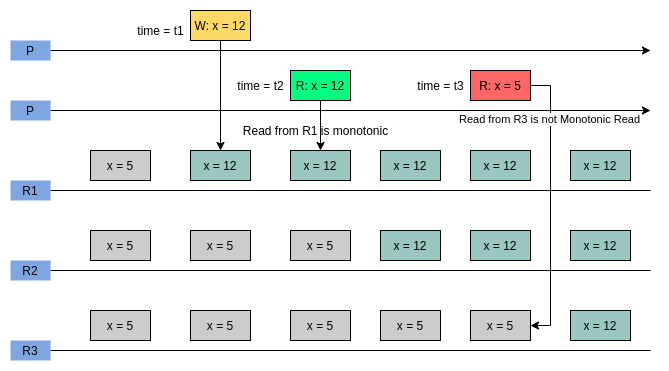

sources:: [Kousik Nath - Consistency Guarantees in Distributed Systems Explained Simply](https://kousiknath.medium.com/consistency-guarantees-in-distributed-systems-explained-simply-720caa034116)

- 
- A bit more formal definition
	- if a Read `R0` observes Write `W` for a piece of data, further Read `R1` by the same unit of execution for the same data in the same session should at least observe `W` or more recent value.
- Extra detail
  collapsed:: true
	- Multiple replicas distributed systems
		- the client can reach out to any replica as long as they have enough updates at least till `W` for the concerned data.
- Properties
  collapsed:: true
	- sticky in nature (like [[RYOW]] )
	- After **network partition**, in a distributed database, the client should **connect back to the same server / same set of servers**.
- No guarantees
  collapsed:: true
	- not a global consistency guarantee, it’s local to a session.
		- updates performed by the current unit of execution might be invisible to others.
- Real Life Example
  collapsed:: true
	- You open Gmail. The mail client makes a request to fetch all the latest aggregated mails. Now you click on the top mail. The mail client makes another request to fetch the content of the mail. What if the second request lands on a server which is unaware of the latest update and fetches nothing? This is possible in a Non-Monotonic Read scenario. The second request should be routed to such a server which has seen the latest data that’s already reflecting in the first request.