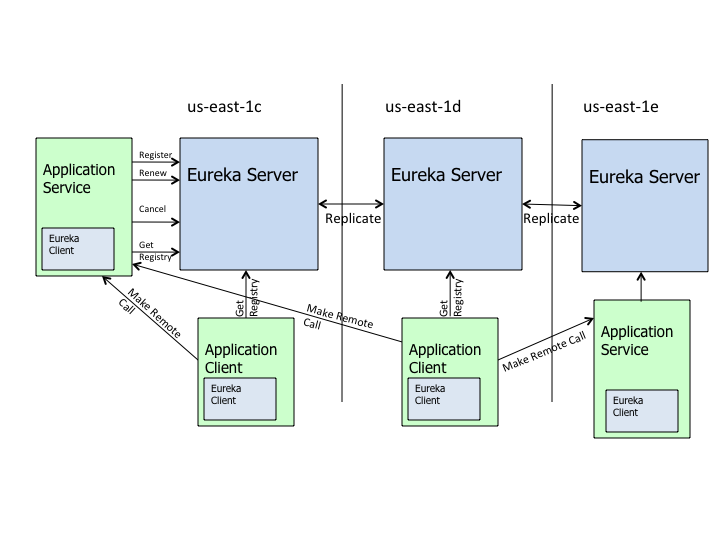

sources:: https://github.com/Netflix/eureka
tags:: Service Discovery, Service Registry, Load Balancer, fail-over

- Short description
	- A [[RESTful]] (Representational State Transfer) service that is primarily used in the AWS cloud for the purpose of discovery, load balancing and failover of middle-tier servers.
- Illustration
  collapsed:: true
	- 
- Configurability
	- timeouts, thread pools, etc
- Resilience
	- Clients
		- handle the failure of one or more Eureka server
		- clients also have a registry cache
	- Servers
		- resilient to other eureka peers going down
- Multiple Regions
- Monitoring
	- track a lot information in both the client and the server for performance, monitoring and alerting.
	- The data is typically available in the JMX registry and can be exported to Amazon Cloud Watch.
- How different is Eureka from [[AWS ELB]]?
	- [[AWS ELB]]
		- edge services (exposed to end-user web traffic) load balancing.
		- a traditional proxy-based load balancing solution
		- support sticky user session [*](https://github.com/Netflix/eureka/wiki/Eureka-at-a-glance)
	- Eureka
		- mid-tier load balancing.
		- the load balancing happens at the instance/server/host level.
			- The client instances know all the information about which servers they need to talk to.
		- does not support sticky user session