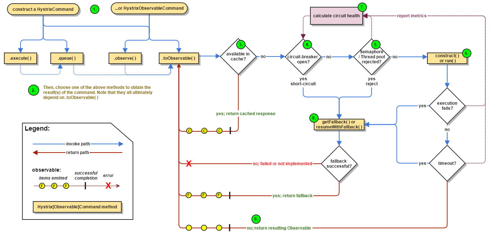
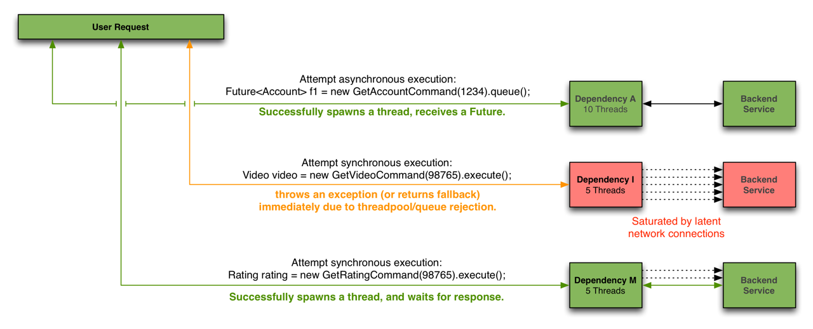

sources:: https://github.com/Netflix/Hystrix, https://github.com/Netflix/Hystrix/wiki/How-it-Works
tags:: Circuit Breaker

- For
	- [[Latency]] and [[fault-tolerance]]
		- Stop cascading failures. Fallbacks and graceful degradation. Fail fast, fail silent and rapid recovery.
		- Thread and semaphore isolation with circuit breakers.
	- Realtime Operations
		- Realtime monitoring and configuration changes.
		- Watch service and property changes take effect immediately as they spread across a fleet.
		- Be alerted, make decisions, affect change and see results in seconds.
	- Concurrency
		- Parallel execution.
		- Concurrency aware request caching.
		- Automated batching through request collapsing.
- Dashboard
  collapsed:: true
	- [[Hystrix Dashboard]]
- Flow Chart
  collapsed:: true
	- 
	- 
- Isolation
  collapsed:: true
	- through [[bulkhead pattern]]
		- isolate dependencies from each other
		- limit concurrent access to any one of them.
	- image
		- 
		  id:: 6283cb91-a378-45cc-948c-5a05624ade12
		-
-
- Threads & Thread Pools
  collapsed:: true
	- Clients (libraries, network calls, etc) execute on separate threads.
		- This isolates them from the calling thread (Tomcat thread pool)
			- so that the caller may “walk away” from a dependency call that is taking too long.
	- Hystrix uses separate, per-dependency thread pools
		- as a way of constraining any given dependency so latency on the underlying executions will saturate the available threads only in that pool.
	- Image
		- 
		- 
-
- Semaphores
	- A choice other than using thread pool/queue sizes to limit the number of concurrent calls to any given dependency.
	- This allows Hystrix to
		- shed load without using thread pools
	- but it does not allow
		- timing out and walking away.
	- If a dependency is isolated with a semaphore and then becomes latent
		- the parent threads will remain blocked until the underlying network calls timeout.
	- Use when
		- You trust the client
		- You only want load shedding
-
- Request Collapsing
  collapsed:: true
	- Collapsing multiple requests into a single back-end dependency call.
	- What to use for
		- to reduce the number of threads and network connections needed to perform concurrent HystrixCommand executions.
	- Cost of its usage
		- Increased latency before the actual command is executed.
		- The maximum cost is the size of the batch window.
	- Image
		- 
-
- Request Caching
	- Command  implementations can define a _cache key_ which is then used to <span style="color: orange">de-dupe calls</span> within a request context in a <span style="color: orange">concurrent-aware</span> manner.
	- Benefits
		- Different code paths can execute Hystrix Commands without concern of duplicate work.
		  background-color:: #497d46
			- especially in large codebases where many developers are implementing different pieces of functionality.
		- Data retrieval is consistent throughout a request.
		  background-color:: #497d46
			- Instead of potentially returning a different value (or fallback) each time the command is executed, the first response is cached and returned for all subsequent calls within the same request.
		- Eliminates duplicate thread executions.
		  background-color:: #497d46
			- Since the request cache sits in front of the construct() or run() method invocation, Hystrix can de-dupe calls before they result in thread execution.
	- example
		- multiple paths through code that all need to get a user’s Account object can each request it like this:
		  ```java
		  Account account = new UserGetAccount(accountId).execute();
		  
		  //or
		  
		  Observable<Account> accountObservable = new UserGetAccount(accountId).observe();
		  ```
		  The Hystrix `RequestCache` will execute the underlying `run()` method once and only once, and both threads executing the `HystrixCommand` will receive the same data despite having instantiated different instances.
		-
	- Image
		- 
-
- Usage example
  collapsed:: true
	- (for the most updated examples, search on the internet)
	- Code is wrapped inside the `run()` method of a `HystrixCommand`
		- ```java
		  public class CommandHelloWorld extends HystrixCommand<String> {
		  
		      private final String name;
		  
		      public CommandHelloWorld(String name) {
		          super(HystrixCommandGroupKey.Factory.asKey("ExampleGroup"));
		          this.name = name;
		      }
		  
		      @Override
		      protected String run() {
		          return "Hello " + name + "!";
		      }
		  }
		  ```
	- Then you use the command
		- ```java
		  String s = new CommandHelloWorld("Bob").execute();
		  Future<String> s = new CommandHelloWorld("Bob").queue();
		  Observable<String> s = new CommandHelloWorld("Bob").observe();
		  ```
-