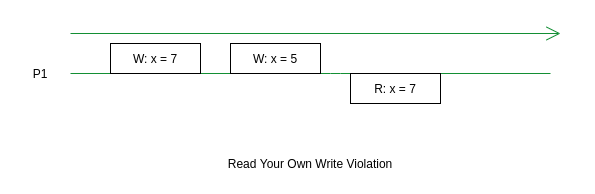

alias:: RYOW, Read-My-Write
sources:: [Kousik Nath - Consistency Guarantees in Distributed Systems Explained Simply](https://kousiknath.medium.com/consistency-guarantees-in-distributed-systems-explained-simply-720caa034116)

- 
- A bit more formal definition
	- if a Read R follows a Write W by the same unit of execution, R should see W.
- A definition with a bit more detail
  collapsed:: true
	- As long as all the requests in a session are served by a single processor / replica or a set of suitable processors / replicas (sticky requests) who know about all updates on the concerned variable / object, the unit of execution should be able to see all updates performed by itself.
	- In case of a distributed system, sticky request also means — if a network partition occurs, the client must connect to the same server with whom it was talking to before the partition.
- No guarantees
  collapsed:: true
	- **Other units** of execution may not see (no guarantee) the update done by the current unit of execution.
- Real Life Example
  collapsed:: true
	- If you delete a mail from Gmail and you get the confirmation, upon refreshing the page, you should not see the mail again in RYOW consistency.
-