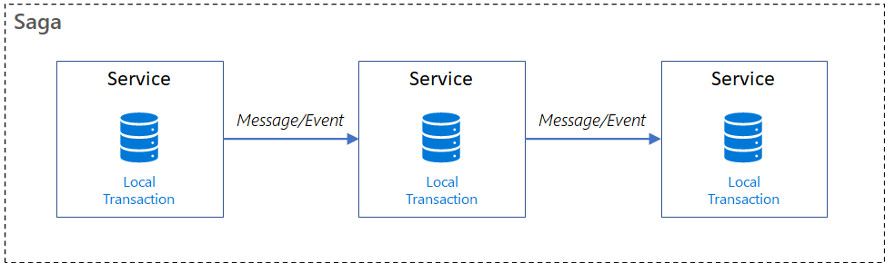

sources:: [Microsoft docs](https://docs.microsoft.com/en-us/azure/architecture/reference-architectures/saga/saga)
tags:: distributed transaction

- Short description
	- a way to manage data [[consistency]] across microservices in distributed transaction scenarios composed of a sequence of transactions that updates each service and publishes a message or event to trigger the next transaction step. If a step fails, the saga executes [[compensating transactions]] that counteract the preceding transactions.
- local transaction
  background-color:: #264c9b
	- atomic work effort performed by a saga participant
- provides transaction management using a sequence of local transactions.
- Each local transaction
	- updates the database
	- publishes a message or event
		- to trigger the next local transaction in the saga.
- If a local transaction fails
	- undo preceding local transaction changes by executing [[compensating transactions]]
- Illustration
	- 
- Pivot transaction
  background-color:: #264c9b
	- The go/no-go point in a saga.
	- If the pivot transaction commits, the saga runs until completion.
	- A pivot transaction can be (one OR the other)
		- a transaction that is neither compensable nor retryable
		- the last [[compensable transaction]] in the saga.
		- the first retryable transaction in the saga.
- Retryable transactions
  background-color:: #264c9b
	- Follow the pivot transaction and are guaranteed to succeed.
-
- common saga implementation approaches
	- choreography #WIP
	  background-color:: #793e3e
	- orchestration #WIP
	  background-color:: #793e3e