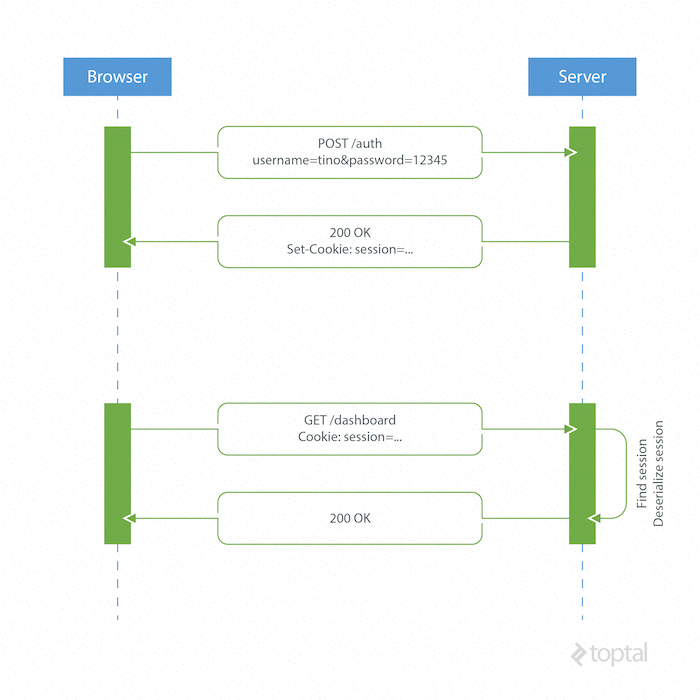

sources:: https://www.toptal.com/web/cookie-free-authentication-with-json-web-tokens-an-example-in-laravel-and-angularjs

- 
- Because the HTTP protocol is stateless, there needs to be a mechanism for storing user information and a way to authenticate the user on every subsequent request after login.
- Most websites use cookies for storing user’s session ID.
-
- How it Works
  heading:: true
	- The browser makes a POST request to the server that contains the user’s identification and password.
		- The server responds with a cookie, which is set on the user’s browser, and includes a session ID to identify the user.
	- On every subsequent request, the server needs to find that session and deserialize it, because user data is stored on the server.
-
- Drawbacks
  heading:: true
	- Hard to scale
	  background-color:: #793e3e
		- The server needs to create a session for a user and persist it somewhere on the server. This can be done in memory or in a database. If we have a distributed system, we have to make sure that we use a separate session storage that is not coupled to the application server.
	- Cross-origin request sharing (CORS)
	  background-color:: #793e3e
		- When using AJAX calls to fetch a resource from another domain (“cross-origin”) we could run into problems with forbidden requests because, by default, HTTP requests don’t include cookies on cross-origin requests.
	- Coupling with the web framework
	  background-color:: #793e3e
		- When using server-based authentication we are tied to our framework’s authentication scheme. It is really hard, or even impossible, to share session data between different web frameworks written in different programming languages.