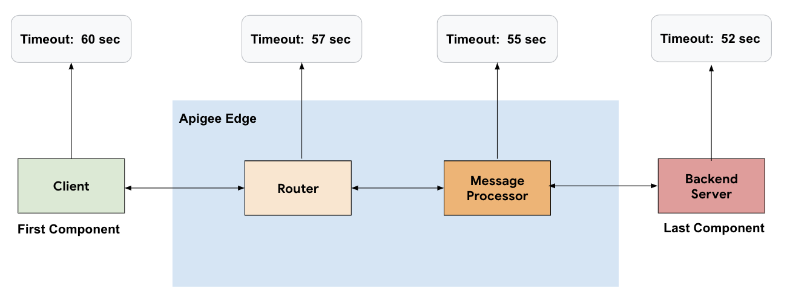
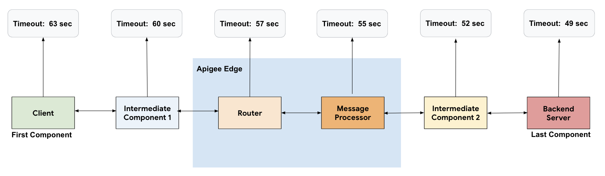

sources:: https://docs.apigee.com/how-to-guides/configuring-io-timeout-best-practices
tags:: timeout, timeliness

- First component
  heading:: true
	- Always use the highest timeout on the first component in the API request flow, which is the Client Application.
- Last component
  heading:: true
	- Always use the lowest timeout on the last component in the API request flow, which is the Backend Service.
- Middle components
  heading:: true
	- Ensure that there is enough seconds also for the middle tier components processing part.
- Router
  heading:: true
	- configure (modify) the I/O timeout value for a specific [[virtual host]] as opposed to configuring it on the Router.
		- This ensures that the new timeout value affects only those API Proxies which are using the specific virtual host and not all the API Proxies being served by the Router.
	- Configure (modify) the I/O timeout on the Router only when
		- you are absolutely sure that the new I/O timeout value is required or applicable for all the API Proxies running on the Router.
- 
   
  This image is of a specific cloud service but the same applies for whichever modules you represent by those boxes.