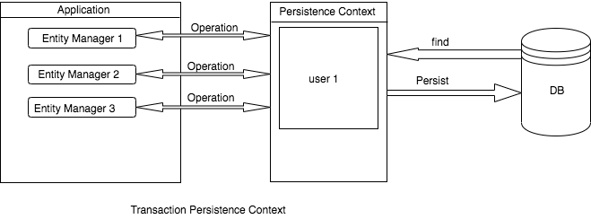

sources:: https://www.baeldung.com/jpa-hibernate-persistence-context

- is bound to the transaction
- As soon as the transaction finishes, the entities present in the persistence context will be flushed into persistent storage.
- When we perform any operation inside the transaction, the EntityManager checks for a persistence context. If one exists, then it will be used. Otherwise, it will create a persistence context.
- The default persistence context type is `PersistenceContextType.TRANSACTION`.
- #+BEGIN_IMPORTANT
  To tell the EntityManager to use the transaction persistence context, we simply annotate it with `@PersistenceContext`:
  #+END_IMPORTANT
	- ```java
	  @PersistenceContext
	  private EntityManager entityManager;
	  ```
- 
-