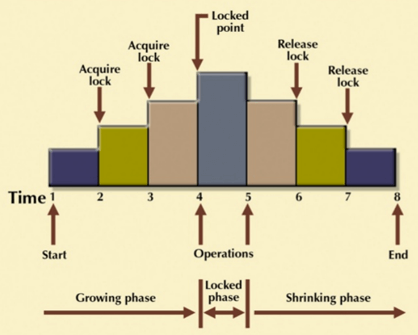

alias:: 2PL
sources:: https://www.guru99.com/dbms-concurrency-control.html

- first phase / growing phase
	- when the transaction begins to execute, it requires permission for the locks it needs.
	- may obtain locks but may not release any locks
- Here you have the locked region until you release the first lock, triggering the shrinking phase.
- second phase / shrinking phase
	- the transaction cannot demand any new locks. Instead, it only releases the acquired locks.
- 
- offers serializability
- does not ensure that deadlocks do not happen.
- [[Strict Two-Phase Locking Method]] - ((626ec565-0215-43f1-bdd1-4acd30a16053))
  id:: 626ec4b3-c328-48b5-9dcc-9c205c80678c
- [[Centralized 2PL]] - ((626ec5d1-9c79-46a2-a737-29078f70f269))
  id:: 626ec541-a10f-4618-b747-54ad77e77301
- [[Primary copy 2PL]] - ((626ec624-dd47-4882-9e78-76602d29616a))
  id:: 626ec552-72ba-4b5a-9415-53dd875d5eb0
- [[Distributed 2PL]] - ((626ec64d-90c8-4fa1-937d-fd9c7143e926))
  id:: 626ec559-af39-4e59-acd1-ca7f998e01af