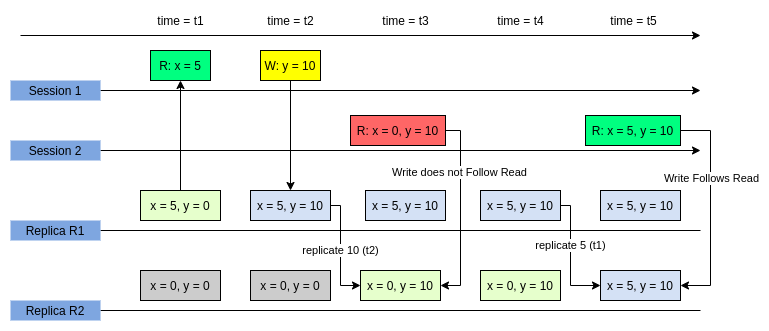

- sources:: [Kousik Nath - Consistency Guarantees in Distributed Systems Explained Simply](https://kousiknath.medium.com/consistency-guarantees-in-distributed-systems-explained-simply-720caa034116)
- 
- Definition
	- Inside a session `S1`, if a write `W1`, a read `R1`, and another write `W2` happens. `W2` must be applied after `W1`. If another session `S2` has seen `W2` then it should have seen `W1` also.
- Longer definition
	- At session `S1` a Write `W1` precedes a Read `R1` i.e; `R1` has seen the effect of `W1`. 
	  `R1` precedes another Write `W2` and `W2` depends on `R1`.
	- `W2` should follow all those Writes which were relevant to `R1`.
		- Ordering guarantee
		- This guarantee applies within the session.
	- If `R1` occurs in server `S1` at time `t1`, then for any server `S2`, if `S2` has seen `W2` at time `t2 > t1`, `S2` must have seen all relevant Writes to `R1` i.e; in our example, `W1` prior to `W2`.
		- All other replicas in the system should apply a Write after they have seen all the previous Writes on which it depends.
			- ((625b239c-1994-4585-bf3d-11d81f9f88b5))
		- This guarantee applies outside of session.
- Guarantees
  collapsed:: true
	- Ordering guarantee
	  id:: 625b204c-ccf6-4685-b3c0-7fcabdc20785
	- Write propagation guarantee
- No guarantees
  collapsed:: true
	- No requirement on how much time it takes to propagate changes.
	  id:: 625b239c-1994-4585-bf3d-11d81f9f88b5
- Properties
  collapsed:: true
	- Ordering first applies within the involved session.
	- Outside of the client’s session, propagation of writes in order of their occurrence should be done
	- This consistency is also called [[session causality]] .
- Real Life Example
  collapsed:: true
	- Consider replying to a tweet. You can only do that when the tweet is already written to the system and is visible to you. Both reading and replying could be done in the same session.
-
-
-