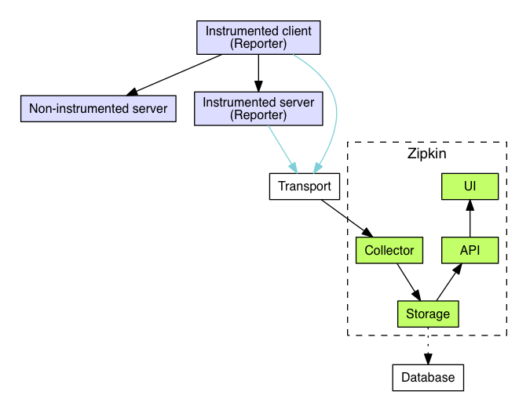

sources:: https://zipkin.io/
tags:: distributed tracing

- Short description
	- A [[Distributed Tracing]] system. It helps gather timing data needed to troubleshoot latency problems in service architectures. Features include both the collection and lookup of this data.
- 
- 