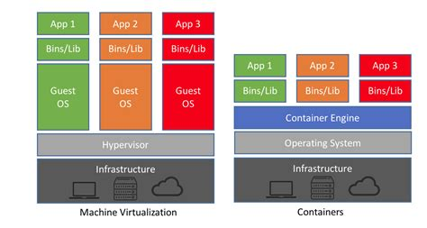

sources:: [NetApp - Containers vs. Virtual Machines (VMs): What's the Difference?](https://blog.netapp.com/blogs/containers-vs-vms/)

- Short description
	- Container is essentially about resource isolation.
- Difference with VMs
	- 
	- VM has an OS with a potentially different kernel
	- Container uses kernel of the host OS