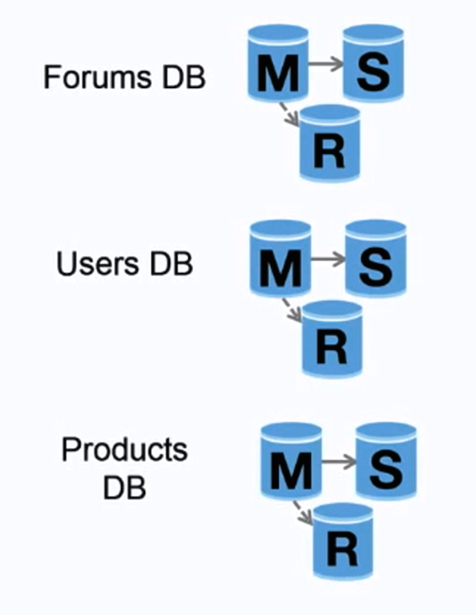

alias:: functional partitioning

- Short description
	- A database scaling technique that splits up databases by function
- Advantages
	- Less read and write traffic to each database and therefore less replication lag
	  background-color:: #497d46
	- More cache hits
	  background-color:: #497d46
		- Smaller databases result in more data that can fit in memory, which in turn results in more cache hits due to improved cache locality.
	- With no single central master serializing writes you can write in parallel, increasing throughput.
	  background-color:: #497d46
- Disadvantages
	- Not effective if your schema requires huge functions or tables.
	  background-color:: #793e3e
	- Joining data from two databases is more complex with a server link.
	  background-color:: #793e3e
	- Federation adds more hardware and additional complexity.
	  background-color:: #793e3e
	- You'll need to update your application logic to determine which database to read and write.
	  background-color:: #793e3e
- 