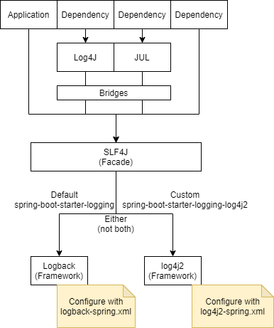

- Inside an app
	- [[logging facade]]
		- [[SLF4j]]
		- [[JCL]]
	- 
- appender: the part of the logging framework that sends your logs to a particular target. [*](https://coralogix.com/blog/spring-boot-logging-best-practices-guide/)
- Tools
	- [[Fluentd]]
-