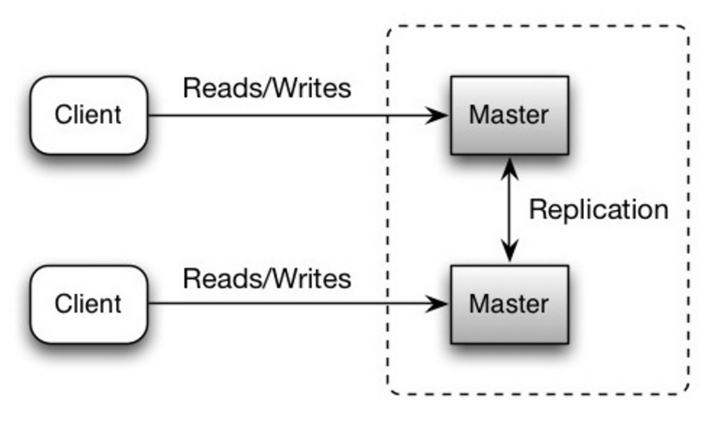

- Short description
	- Both masters serve reads and writes and coordinate with each other on writes.
- If either master goes down
	- the system can continue to operate with both reads and writes.
- Disadvantages
	- You'll need a load balancer or you'll need to make changes to your application logic to determine where to write.
	  background-color:: #793e3e
	- Most master-master systems are either loosely consistent (violating ACID) or have increased write latency due to synchronization.
	  background-color:: #793e3e
	- . Conflict resolution comes more into play as more write nodes are added and as latency increases.
	  background-color:: #793e3e
	- And the general disadvantages of [[replication]]
	  background-color:: #793e3e
- 