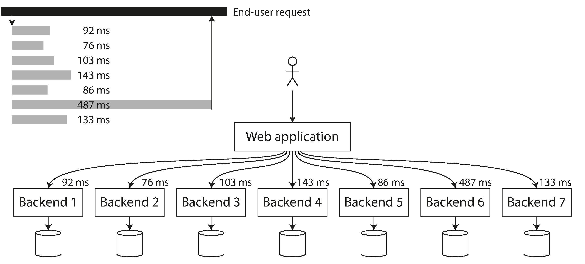

sources:: ((627ab639-9cec-4c04-87d9-012a65393028))

- Short description
	- is what the client sees: besides the actual time to process the request (the service time), it includes network delays and queueing delays.
- think of response time not as a single number, but as a distribution of values that you can measure.
- Usually it is better to use percentiles
- it is important to measure response times on the client side.
- Queueing delays often account for a large part of the response time at high percentiles
	- As a server can only process a small number of things in parallel, it only takes a small number of slow requests to hold up the processing of subsequent requests—an effect sometimes known as head-of-line blocking. Even if those subsequent requests are fast to process on the server, the client will see a slow overall response time due to the time waiting for the prior request to complete.
- When several backend calls are needed to serve a request, it takes just a single slow backend request to slow down the entire end-user request.
	- 