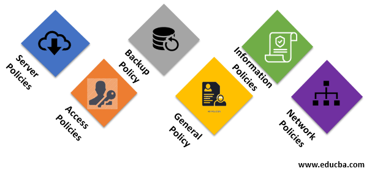

sources:: https://www.educba.com/security-policies/

- Short description
	- The set of rules and procedures which has been followed to endorse the security of the system or organization.
	  id:: 628298b7-ca55-4cc8-8b95-97ae6bd5340a
- the guidelines that have to be practiced throughout the organization to comply with the information security standards.
- 