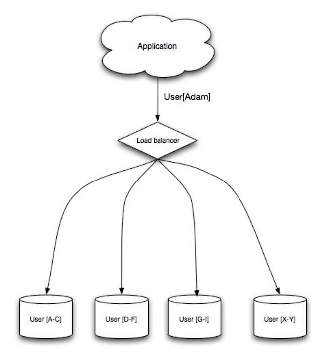

- Short description
	- A database scaling technique that distributes data across different databases such that each database can only manage a subset of the data.
- Advantages
	- less read and write traffic
	  background-color:: #497d46
	- less replication
	  background-color:: #497d46
	- more cache hits
	  background-color:: #497d46
	- reduced index size
	  background-color:: #497d46
		- which generally improves performance with faster queries.
	- If one shard goes down, the other shards are still operational
	  background-color:: #497d46
		- although you'll want to add some form of replication to avoid data loss.
	- no single central master serializing writes
	  background-color:: #497d46
		- allowing you to write in parallel with increased throughput.
- Disadvantages
	- You'll need to update your application logic to work with shards
	  background-color:: #793e3e
		- could result in complex SQL queries.
	- Data distribution can become lopsided in a shard.
	  background-color:: #793e3e
		- For example, a set of power users on a shard could result in increased load to that shard compared to others.
	- Rebalancing adds additional complexity.
	  background-color:: #793e3e
		- A sharding function based on consistent hashing can reduce the amount of transferred data.
	- Joining data from multiple shards is more complex.
	  background-color:: #793e3e
	- Sharding adds more hardware and additional complexity.
	  background-color:: #793e3e
- 