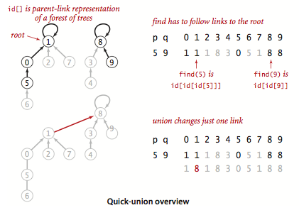
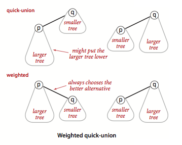

- Short description
	- Performs two useful operations on a [[Disjoint-set]] : <span class="hl-neutral-01">Find</span>: Determine which subset a particular element is in. <span class="hl-neutral-01">Union</span>: Join two subsets into a single subset.
- Usages
	- used to check whether an undirected graph contains cycle or not
- Basic characteristics
	- initializes an array with values = indexes. [0, 1 ... n], let's call it `id` array.
	- if `id[x] == id[y]`, `x` and `y` are _'connected'_, in other words, belong to the same set.
- Implementations
	- Quick-find
	  background-color:: #497d46
		- When making an union, traverse all the array equalizing the value for the 2 sets that are being unified.
	- Quick-union
	  background-color:: #497d46
		- The `id[]` entry for each site will be the name of another site in the same component (possibly itself).
			- sometimes `id[]` is called `parent[]` or `group[]`
		- `root` is a `id[]` to which `id[n] == n`
		- a `root` contains the name of an currently existing group
		- sites pointing to the same `root` are connected (reachable) between each other. In other words, they belong to the same group.
		- Union operation has just to find 2 roots and change one link.
		- 
	- Weighted quick-union
	  background-color:: #497d46
		- Keeps track of the size of each tree and always connect the smaller tree to the larger.
		- The data structure must have an extra array of same size as `id[]`, to store the sizes.
		- 
		- ```java
		      public void union(int p, int q) {
		          int rootP = find(p);
		          int rootQ = find(q);
		          if (rootP == rootQ) return;
		  
		          // make smaller root point to larger one
		          if (size[rootP] < size[rootQ]) {
		              id[rootP] = rootQ;
		              size[rootQ] += size[rootP];
		          }
		          else {
		              id[rootQ] = rootP;
		              size[rootP] += size[rootQ];
		          }
		          count--;
		      }
		  ```
	- Weighted quick-union with path compression
		- Whenever making a find operation, making all the nodes that we do examine directly link to the root.
		- ```java
		          public int find(int i) {
		              while (i != id[i]) {   // while you are not the root
		                  id[i] = id[id[i]]; // points i's parent to its grandparent
		                  i = id[i];         // moves to its new parent (which is the previous grandparent)
		              }
		              return i;
		          }
		  ```